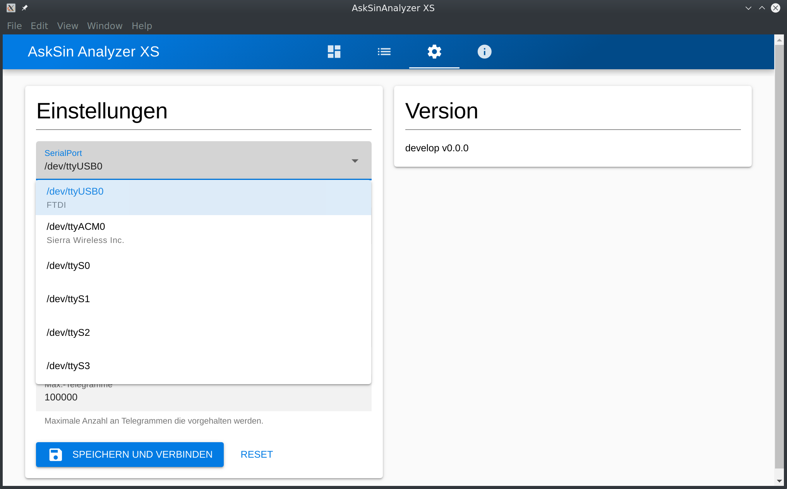

# AskSin Analyzer XS

Funktelegramm-Dekodierer für den Einsatz in HomeMatic Umgebungen als Desktop-App.

Der AskSin Analyzer XS ist eine alternative Implementierung des [AskSinAnalyzer](https://github.com/jp112sdl/AskSinAnalyzer) ohne ESP32 und Display was die Umsetzung vereinfacht.

Benötigte Hardware für den AskSinSniffer328P:
* Arduino Pro Mini 8Mhz 3.3V
* CC1101 Funkmodul
* USB-UART Adapter (FTDI, CP2102, etc)

Die Daten des AskSinSniffer328P werden über den USB-UART Adapter an den AskSinAnalyzerXS übertragen und dort ausgewertet und visualisiert.

## Installation

* [Latest release](https://github.com/psi-4ward/AskSinAnalyzerXS/releases/latest)
* [Develop release](https://github.com/psi-4ward/AskSinAnalyzerXS/releases/tag/untagged-dd93ed541a30cbade0aa) v0.0.0

### AVR Sketch

Auf dem ATmega328P wird der [AskSinSniffer328P-Sketch](https://github.com/jp112sdl/AskSinAnalyzer/tree/master/AskSinSniffer328P) geflasht. Grundlegends ist auf [asksinpp.de](https://asksinpp.de/Grundlagen/) erläutert.

### Electron-App

Die Desktop-Anwendung steht für Windows, MacOS und Linux zum Download unter [Releases](https://github.com/psi-4ward/AskSinAnalyzerXS/releases) bereit.

Tipp: Der AskSinAnalyzerXS gibt einige Debug-Informationen auf der Commando-Zeile aus. Bei Problemen empfiehlt sich also ein Start über ein Terminal. (Bash, cmd).

### Node-App

Der AskSinAnalyzerXS kann auch als Node.js Anwendung betrieben werden was z.B. auf einem Server sinnvoll sein kann.

Hierzu ist ein eigener Build geplant aber aktuell noch nicht umgesetzt.

## Lizenz

CC BY-NC-SA 4.0
