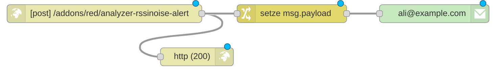
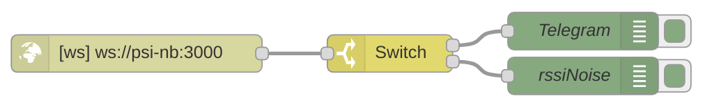

# NodeRED Integration

[NodeRED](https://nodered.org/) ist als Addon [RedMatic](https://github.com/rdmtc/RedMatic#readme) für die CCU verfügbar.

## RSSI-Noise Alert Trigger

Der RSSI-Noise Alert Trigger kann einen HTTP-Request ausführen, wenn der Threshold für die angegebene Zeit
überschritten wurde. Dieser kann u.a. in NodeRED weiter verarbeitet werden um z.B. eine E-Mail oder Telegram-Messenger
Nachricht zu verschicken.

Eine `http in` Node empfängt den HTTP-Request. **Wichtig** ist, dass dieser Request über eine `http response` Node mit einem
Status-Code 200 quittiert wird. Zudem kann der Request nun weiterverarbeitet werden, z.B. über eine `change` Node
um den Payload als leserlichen Text zu setzen und anschließend eine E-Mail zu verschicken.
  

## WebSocket Verbindung

Der AskSin Analyzer XS exposed einen WebSocket der über NodeRED konsumiert werden kann.
Hier kommt die `websocket in` Node zum Einsatz. In der Node-Konfigruation wird als Typ `Verbinden mit` gewählt 
und die URL entsprechend dem Server gesetzt auf dem der Analyzer läuft. Z.B. `ws://mein-server:8081`.

Es werden nun alle Nachrichtenobjekte des Analyzers in den Flow injiziert. Interessant dürften hier vor allem `type=rssiNoise`
und `type=telegram` sein. Der `payload` besteht aus den Nutzdaten des jeweiligen Typs. Zeitstempel (telegram.tstamp bzw rssiNoise[0])
sind JavaScript-like in Millisekunden.

Damit kann NodeRED anhand von Telegrammen, DutyCycle oder RSSI-Noise weitere Aktionen auszuführen.

